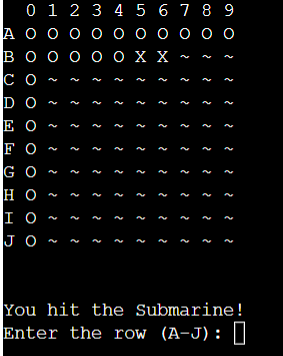

# Battleship - Game

"Welcome, to the battlefront!
In this single-player game you can play a game of battleship and try to sink the computers ships in as few guesses or fastest time as possible!"

LIVE WEBSITE

You can view a live version of the game here.<https://battleshipsjesper-7cb0f9392406.herokuapp.com/>

GITHUB PAGES

You can view the GitHub code pages here. (https://github.com/Jesper941/battleshipsgame)

## CONTENTS

- [BATTLESHIP - GAME](#battleship---game)
  - [CONTENTS](#contents)
      - [Visitors Goals](#visitors-goals)
      - [First-Time Visitor Goals](#first-time-visitor-goals)
      - [Returning Visitor Goals](#returning-visitor-goals)
      - [Frequent Visitor Goals](#frequent-visitor-goals)
  - [Design](#design)
    - [ASCII Artwork](#ascii-artwork)
    - [Function Styling](#function-styling)
  - [Features](#features)
  - [How to Play](#how-to-play)
    - [Navigation](#navigation)
    - [Future Implementations](#future-implementations)
    - [Accessibility](#accessibility)
  - [Technologies Used](#technologies-used)
    - [Languages Used](#languages-used)
    - [Local Development](#local-development)
      - [How to Fork](#how-to-fork)
      - [How to Clone](#how-to-clone)
  - [Testing](#testing)
  - [Credits](#credits)
    - [Code Used](#code-used)
    - [Content](#content)
    - [Media](#media)
    - [Feedback](#feedback)
  
---

#### Visitors Goals

The main goal for any visitor would be to enjoy a challenging game of Battleship against the computer and test their strategic skills.
Another goal is to compete with friends or family members to determine who can sink the computer's ships most efficiently.
To spend some leisure time with an engaging and interactive game.
Divided into different categories, the visitor's goals may look like this:

#### First-Time Visitor Goals
- I want to experience a game of Battleship against the computer.
- I want to have fun and test my strategic thinking.
- I want to explore the game and learn how to play.
- I want to see what the game has to offer and how challenging it is.

#### Returning Visitor Goals
- I want to improve my gameplay and try different strategies.
- I want to beat my previous high score and achieve better results.
- I want to challenge my friends to see who can defeat the computer's fleet more efficiently.

#### Frequent Visitor Goals
- I want to compete with my friends to see who's the best or fastest.
- I want to see if there are any new challenges or game modes added to enhance my experience from time to time.

---

## Design

### ASCII Artwork

Here is a piece of ASCII Artwork i used in the welcome screen of the game

### Function Styling

- Here is the welcome page where the player will answer a prompt if he wants to play or not, and then to enter his username.

- Once you've entered a valid username, tthe game will start and the grid will appear

- If you hit a ship, the game will tell you that you hit a ship, and it will be marked as an X on the grid.
  

- If you miss, the game will tell you that you missed and it will be marked as an O on the grid.

- If you sink one of the computers ships, the game will tell you which ship has sunk.
  
  
  
- Once you sink all the computers ships, you will get taken to the endscreen where you will be congratulated for winning.
  
  

  
---

## Features

What does this game feature?

- A strategic Battleship game against the computer.
- A 10x10 grid for placing your fleet and making guesses.
- Five different ship types, each with its own size.
- A user-friendly interface with a clear grid display.
- Real-time tracking of hits and misses.
- An end screen displaying "Congratulations, you've sunk all the computer's ships!" when the game is won.
- A personalized touch with the player's username on the end screen.
- An option to restart and play the game again to further test your strategic skills.

## How to Play

- Visit the Battleship game's webpage.
- Answer the yes or no prompt.
- Enter your username.
- Guess where all the computer ships are located.
- Click "Run Program" again to try and do it faster or better.

### Navigation

Navigation is super easy, it's all right there!

### Future Implementations

- Add so that players can chose which ships will appear
- Add a multiplayer version
- Add an AI that plays against you in single-player mode
- Add some more descriptive text in the different phases of the game.

---

### Accessibility

I've used the Code Institute template as insctructed so i have lended all the accesibility up to them.
---

## Technologies Used

### Languages Used

I used Python to create this game.

### Local Development

Instructions on how to fork and clone the project.

#### How to Fork

1. Log in (or sign up) to Github.
2. Go to the repository for this project, (https://github.com/Jesper941/battleshipsgame))
3. Click the Fork button in the top right corner.

#### How to Clone

Log in (or sign up) to GitHub.
1. Go to the repository for this project, (https://github.com/Jesper941/battleshipsgame))
2. Click on the code button, select whether you want to clone with HTTPS, SSH, or GitHub CLI, and copy the link shown.
3. Open the terminal in your code editor and change the current working directory to the location you want to use for the cloned directory.
4. Type 'git clone' into the terminal and then paste the link you copied in step 3. Press enter.

## Testing

You can find all of the testing done in the [TESTING.md file](TESTING.md)

## Credits

Here i'm gonna list the credits to all the sources that helped me out during this project.

### Code Used

1. https://ascii.co.uk/art/battleship - ASCII Artwork for welcome screen
2. https://www.youtube.com/watch?v=tF1WRCrd_HQ - Help with making the game
3. https://www.youtube.com/watch?v=7Ki_2gr0rsE - Help with making the game
4. https://bottlepy.org/docs/dev/ - How to use bottle
5. https://realpython.com/developing-with-bottle-part-1/ - How to use bottle
6. https://www.w3schools.com/python/module_os.asp#:~:text=Python%20has%20a%20built%2Din,variables%2C%20process%20management%2C%20etc. - More information about the os module for python.
7. https://realpython.com/python-for-loop/ - Some extra repetition on for loops to help me make all the functions
8. Code Institute academic literature - All the videos and information we recieved in the course
### Content

I wrote the code myself but with some help from the sites and people mentioned above on how to execute my idea.

###  Media

No media images in this project.

### Feedback

If you have any feedback or questions, please reach out to me via my email: Jesper941@hotmail.com